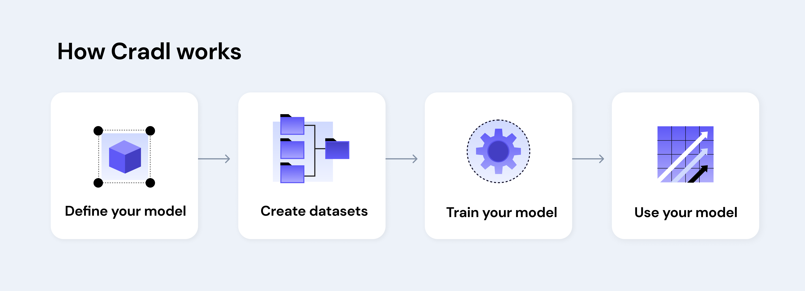

# Welcome to Cradl

Welcome to Cradl, the platform where developers can **create custom machine learning models for reading document data**. Use your data to build your own tailor-made models for extracting structured data from semi-structured documents. Define, train and deploy your model on Cradl - **no machine learning expertise required.**

## Structured data extraction

Every day, everywhere, everyone parses information from documents such as invoices, receipts, price tags and ID cards. The document formats can vary, the information does not. We want to read amounts, dates, names, VAT details, SWIFT codes, invoice and phone numbers. We _know_ the data exists in that image or that PDF, we _just need to parse it_, but doing so requires a human or AI to read it. This is the hallmark of semi-structured data: it lacks a fixed format, but there's valuable information in it _**that can be structured**_.

Cradl's approach to extracting structured data is _**learning by example, not by instruction**_. No need to customize stencils and keywords for every single document type - our machine learning models teach themselves how to read the data you need from your collection of documents. All you need to do is upload enough example data for our models to get going, tell them what to look for and sit back as your custom machine learning model gets trained. Oh - and you don't have to worry about deploying the model, we take care of that, too.

## Getting started

- Jump straight to the section for [quickstart guides](use-cases/invoice_model.md) if you want a flying start. 
- For a bit more extensive introduction on the usage of CLI and SDK, continue with the [Get Started section](get-started/installation.md).
- If you want a better overview of the API and its key components we recommend you to dive into the [Concepts](concepts/models.md).