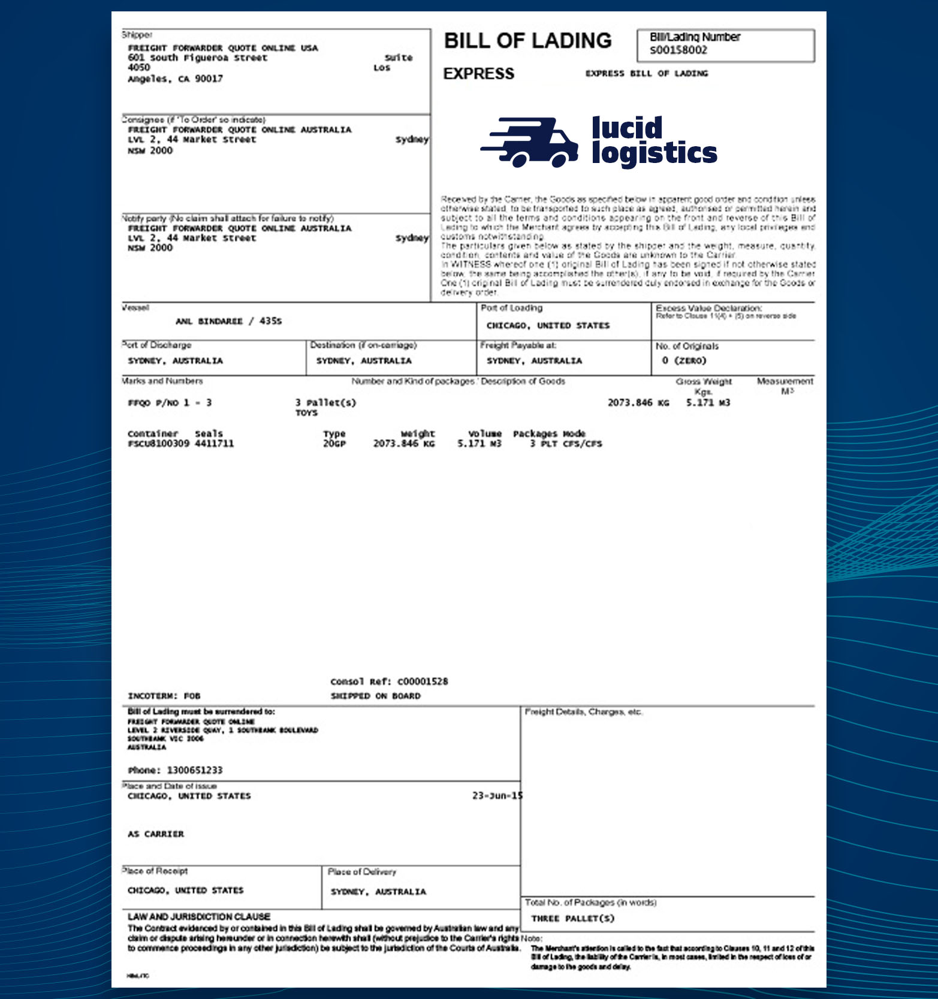

# Documents

A _document_ in Cradl is a single data point to be used for [model training](models.md) or [Predictions](predictions.md). A document consists of a file with optional ground truth metadata. The ground truth metadata is used when training your model. Documents can be grouped in [Datasets](datasets.md).

## Creating a Document

Documents can be created via Cradl's [various API clients](../get-started/installation.md).


Allowed formats for documents are PDF, JPEG, PNG and TIFF.




```bash
las documents create path/to/my/document.pdf
```



```bash
curl -X POST 'https://api.cradl.ai/v1/documents' \
--header 'Content-Type: application/json' \
--header 'Authorization: Bearer eyJra...' \
--data-raw '{
    "content": "JVBERi0xLjQ...",
    "contentType": "application/pdf"
 }'
```



```python
document = client.create_document(b'<bytes data>', 'application/pdf')
```



```javascript
{
  "documentId": "las:document:84ed1bb2d2634072bd3134274ed56ebe",
  "contentType": "application/pdf"
}
```

The returned`documentId` can be used together with a `modelId` to make a [prediction](predictions.md#making-a-prediction) on the document once a model has been trained. You can also [set a ground truth](documents.md#setting-ground-truths) for the document and add it to a [Dataset](datasets.md) to use it as training data for a model.

## Setting ground truths

To use a document as training data, it must have an attached ground truth; since our models learn by example, you must provide both the example input \(the file\) and its expected output \(the ground truth\). The ground truth can be provided when you create the document, or it can be added as an update to an existing document.



```bash
las documents create path/to/document.pdf --ground-truth-fields amount=100.00 due_date='2021-05-20'
las documents create path/to/document.pdf --ground-truth-path path/to/ground_truth.json
las documents update <document-id> --ground-truth-fields amount=100.00 due_date='2021-05-20'
las documents update <document-id> --ground-truth-path path/to/ground_truth.json
```



```bash
curl -X POST 'https://api.cradl.ai/v1/documents' \
--header 'Content-Type: application/json' \
--header 'Authorization: Bearer eyJra...' \
--data-raw '{
    "content": "JVBERi0xLjQ...",
    "contentType": "application/pdf"
    "groundTruth": [
      {
        "label": "amount",
        "value": "100.00"
      },
      {
        "label": "due_date",
        "value": "2021-05-20"
      }
    ]
  }'


curl -X PATCH 'https://api.cradl.ai/v1/documents/<documentId>' \
--header 'Content-Type: application/json' \
--header 'Authorization: Bearer eyJra...' \
--data-raw '{
    "groundTruth": [
      {
        "label": "amount",
        "value": "100.00"
      },
      {
        "label": "due_date",
        "value": "2021-05-20"
      }
    ]
  }'
```



```python
ground_truth = [
  { 'label': 'total_amount', 'value': '100.00' },
  { 'label': 'due_date', 'value': '2020-02-28' }
]
document = client.create_document(b'<bytes data>', 'application/pdf', ground_truth=ground_truth)
# or
document = client.update_document(<document_id>, ground_truth=ground_truth)
```



```
[
  {
    "label": "amount",
    "value": "100.00"
  },
  {
    "label": "due_date",
    "value": "2021-05-20"
  }
]
```



 The JSON format for a ground truth file is an array of objects containing `label` and `value` keys. See below for examples. Values in the objects must be strings.


The label name is used as a key in several places. Make sure you are consistent in using the same label names across documents and models.








```javascript
[
  {
    "label": "category",
    "value": "taxi"
  },
  {
    "label": "currency",
    "value": "EUR"
  },
  {
    "label": "date",
    "value": "2019-12-31"
  },
  {
    "label": "total_amount",
    "value": "43.90"
  }
]
```







```javascript
[
  {
    "label": "lading_number",
    "value": "s00158002"
  },
  {
    "label": "point_of_loading",
    "value": "Chicago, United States"
  },
  {
    "label": "place_of_delivery",
    "value": "Sydney, Australia"
  },
  {
    "label": "date",
    "value": "2015-06-23"
  },
  {
    "label": "carrier",
    "value": "Lucid Logistics"
  },
  {
    "label": "weight",
    "value": "20000"
  }
]
```



## Documents with personal consents

In addition to grouping documents in datasets, documents can be assigned a `consentId` to facilitate deletion of single-user data. If your application requires users to register data use consent, you should label this consent by a user-unique ID, and label all user data uploaded to Cradl with a corresponding `consentId` at creation time.



```bash
las documents create path/to/document.pdf --consent-id <user-unique-id>
```



```bash
curl -X POST 'https://api.cradl.ai/v1/documents' \
--header 'Content-Type: application/json' \
--header 'Authorization: Bearer eyJra...' \
--data-raw '{
    "content": "JVBERi0xLjQ...",
    "contentType": "application/pdf",
    "consentId": <user-unique-id>
 }'
```



```python
document = client.create_document(b'<bytes data>', 'application/pdf', consent_id=<consent_id>)
```



## Deleting documents

Documents may be deleted one-by-one:



```bash
las documents delete <document-id>
```



```bash
curl -X DELETE 'https://api.cradl.ai/v1/documents/<documentId>' \
--header 'Content-Type: application/json' \
--header 'Authorization: Bearer eyJra...' \
```



```
client.delete_document(<document_id>)
```



Or using a group identifier \(`consentId` or `datasetId`\):



```bash
las documents delete-all --dataset-id <dataset-id>
```



```bash
curl -X DELETE 'https://api.cradl.ai/v1/documents/<documentId>' \
--header 'Content-Type: application/json' \
--header 'Authorization: Bearer eyJra...' \
--data-raw '{
    "datasetId": <datasetId>
 }'
```



```python
client.delete_documents(dataset_id=<dataset_id>, delete_all=True)
```



```javascript
{
  "documents": [...],
  "consentId": [...]
}
```

The delete-all command will delete all documents with the given group identifier.

