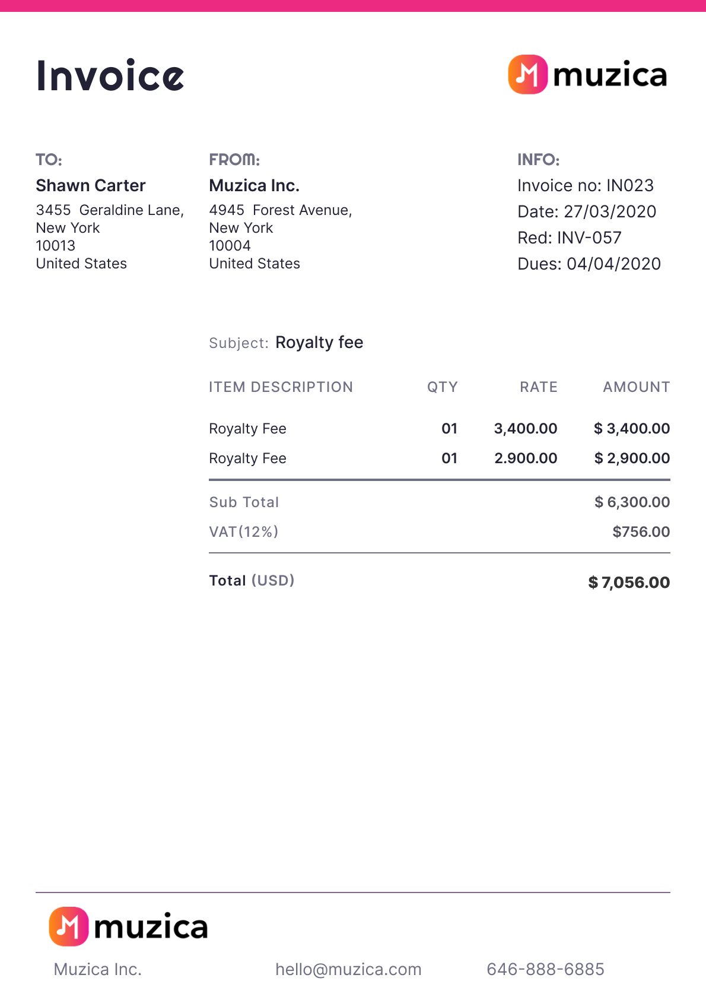

import Tabs from "@theme/Tabs";
import TabItem from "@theme/TabItem";
import ScrollProgressBar from "/src/components/ScrollProgressBar";

# How to create an AI Model

<h3>
  
    Welcome to Cradl AI!
  
  In this guide, you will train an AI model to automatically extract data from your
  image or PDF documents into JSON, ready for export to your other apps.
</h3>

<ScrollProgressBar />

The guide takes 15 minutes to 1 hour, depending on how thoroughly you train your model. For those who prefer a visual learning experience, the video tutorial below covers the same content:

<iframe
  width="560"
  height="315"
  src="https://www.youtube.com/embed/E_zXAPF2K9A?si=v8DoNlI3idRm-Viw"
  title="YouTube video player"
  frameborder="0"
  allow="accelerometer; autoplay; clipboard-write; encrypted-media; gyroscope; picture-in-picture; web-share"
  referrerpolicy="strict-origin-when-cross-origin"
  allowfullscreen
></iframe>

## Create a free Cradl AI account

Start by completing the sign-up to a [free Cradl AI account](https://app.cradl.ai/login). You will be redirected to your Models after completing the sign up.

&#8226; **Click on New Model**

  

  

## Create a new AI Model

Welcome to your model overview. It consits of AI Model, Validation, Trigger, and Export. You only need to configure AI Model to start parsing your documents.

&#8226; **Click on AI Model**

  

  

## What type of document do you have?

Invoices, Pruchase Orders, Bills of Lading, ID Cards, contracts, etc. - there are many types of documents in the world. What type of document do you want to parse?

Start with a template if we have template for your document type, if not, start from scratch.

  

  

**Model from template vs. model from scratch**

  Whether to start from scratch or whether to start from a template depends on
  what you want to extract from your documents.

For example, you may have invoices from which you want extract fields such as a _total amount_, a _supplier name_, an _invoice number_, and so on. If you browse through the templates, you will find an invoice template that have those fields. In that case, you should start with a template instead of from scratch. You can easily add and remove fields from templates if necessary.

If your documents are unlike any of our templates, then choose to start from scratch.

## Which fields do you want to extract from your documents?

  For every piece of information you want to extract from your documents, you
  create a corresponding field in your AI Model, so make a list of the data you
  want to extract from your documents. It is recommended to only include *data
  that you need* when training your first model. You can introduce data that is
  *nice to have* once you are getting good results from your initial model.

Your amount of fields is flexible; you can start with a limited amount and introduce new fields in the future if neccessary.

  
See example

  

    

      Typical data you would want to extract from an invoice include: the
      recipent's full name, the recipient's address, invoice ID number, total
      amount, VAT, currency, etc.
    

    
  

## Name your fields

A field consists of a title and a data type.

A field's title is yours to decide. It does not have to correspond to what you see on your documents. For example, if your documents have a total amount of 20.000 labelled as "total: 20.000", you are free to call your field's name total, total amount, price, or something in another language.

  

  

:::warning
Avoid changing a field's title once you have started training your model &lpar;we will train the model in the next section of this tutorial&rpar;. Changing the title of your fields after training will require you to retrain that specific field.
:::

## Set your field types

<Tabs>
  <TabItem value="string" label="String" default>
    
String is the most commonly used type. It is used for data containing letters or a mix of letters and numbers.

    
A common usecase for strings are addresses, which you can create in one string field instead of making multiple fields for each line of the address:

    

        
Example of a multiline address in a String field.

        
    

  </TabItem>

<TabItem value="amount" label="Amount">
  
Use the Amount type if your document has monetary amounts.

</TabItem>
<TabItem value="date" label="Date">
  
Use the Date type if your document has dates.

</TabItem>

<TabItem value="numeric" label="Numeric">
  

    Numeric is used for numbers, such as quantities, numeric IDs, etc. A Numeric
    field does not accept letters.
  

</TabItem>

<TabItem value="lineItems" label="Line items">
  
Line items are used for single and multiline tabular data:

  

    
Example of multiline tabular data.

    
  

</TabItem>

    <TabItem value="classification" label="Classification">
        
The 'Classification' type is ideal when your model must predict one of several pre-defined classes. For instance, you might include a classification field with two classes, INVOICE and CREDIT_NOTE, to discern whether a document is an invoice or a credit note. Classification is often also recommended for reading out currencies from documents.

    </TabItem>

</Tabs>

&#8226; **Click Create** when you have finished configuring your fields.

