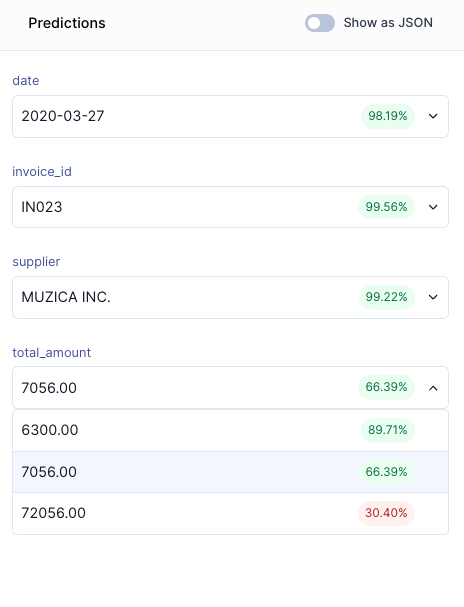

# How to test an AI model
import ScrollProgressBar from '/src/components/ScrollProgressBar'

<ScrollProgressBar />

## Upload documents to test
&#8226; **Click on Run** in the upper right corner of your model from your model overview. Upload some of your invoices.

&#8226; **Click on Run model** once your documents are uploaded.

## Run model
You just extracted data from your first document. Well done! You can inspect the extracted data on the right-hand side:

{/* 

  
Inspect extracted data

Based on 15 training documents, the model:

<ul> 
<li> Predicted 5/5 fields correctly. However, the correct value for `total_amount` is not the first, but the second likeliest prediction. This indicates that more training data is necessary. </li>
<li> ISO formats dates automatically. </li>
</ul>
 

 

 */}

## Go to Validator
Now that you have tested your AI model, it is time to go to the *Validator*. The Validator is where you correct potential mistakes and thereby improve your model.

&#8226; **Click on the Validated output tab**

&#8226; **Click on Open validator**

