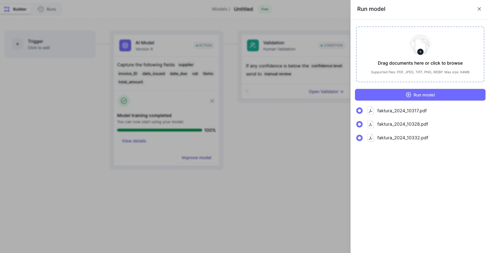
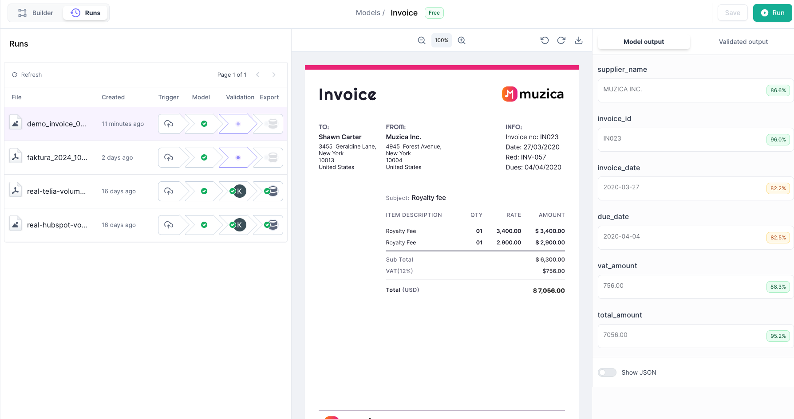
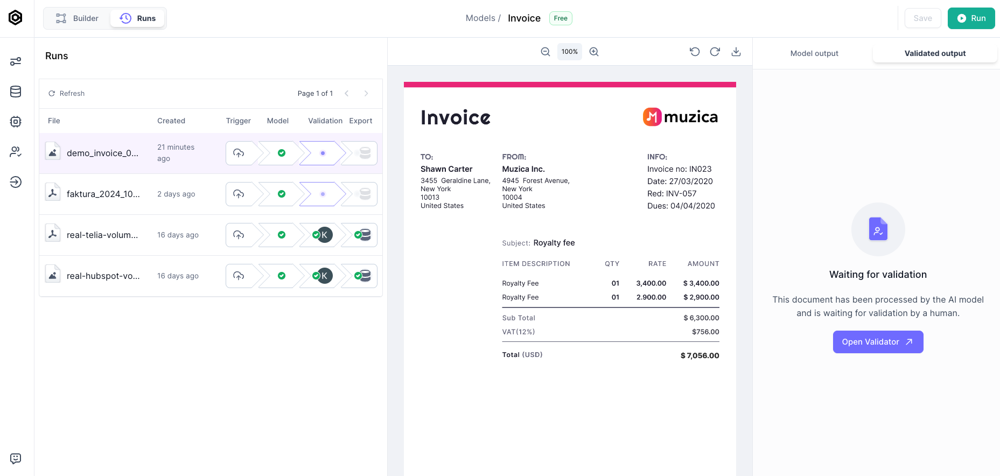

# How to test an AI model

import ScrollProgressBar from "/src/components/ScrollProgressBar";

<ScrollProgressBar />

## Upload documents to test

&#8226; **Click on Run** in the upper right corner of your model from your model overview. Upload some of your invoices.

&#8226; **Click on Run model** once your documents are uploaded.

  

  

## Run model

You just extracted data from your first document. Well done! You can inspect the extracted data on the right-hand side:

  

  

## Go to Validator

Now that you have tested your AI model, it is time to go to the _Validator_. The Validator is where you correct potential mistakes and thereby improve your model.

&#8226; **Click on the Validated output tab**

&#8226; **Click on Open validator**

  

  

