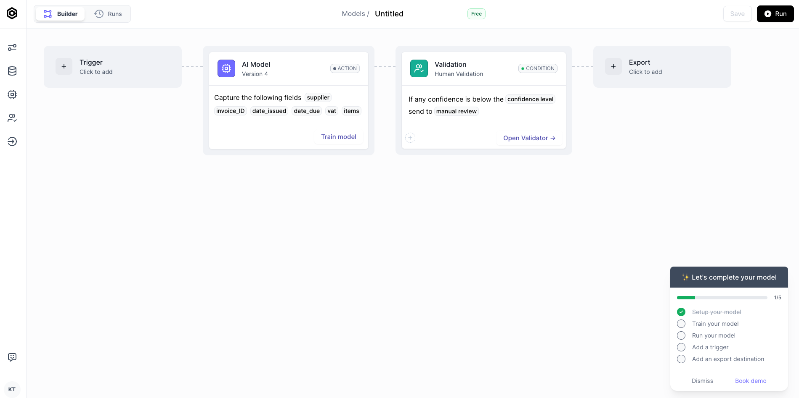

import Tabs from '@theme/Tabs';
import TabItem from '@theme/TabItem';
import ScrollProgressBar from '/src/components/ScrollProgressBar'

# How to train an AI model

Training your AI Model for the first time requires you to *annotate* a minimum of 5 documents for your AI Model to learn from. However, the more documents you annotate, the better your AI Model will perform. 

<ScrollProgressBar />

## Pick your first training documents

&#8226;  Prioritise your high-volume documents. For example, if you have x10 more invoices from one vendor, start by training on invoices from that vendor. You can train on less important documents later.

&#8226;  You will likely want to extract data that might be *present* on some documents, but *absent* from other documents. For example, 5 of your documents might have "total amount" whereas "VAT" might only be present on 3. For best results, try to compensate for the 2 documents without "VAT" by including 2 new documents with VAT, bumping your total documents up to 7. Your aim is to have 5 samples of every field rather than 5 documents.

## Upload your training documents

**Click Train model** from your model overview if you created a model from scratch. However, **Click Improve model** if you created model from a template. Follow the upload instructions to upload your training documents. 

  

## Annotate your training documents
You tell your AI Model "what to look for" in your documents by copying the field on your document into its corresponding input field. This is called *annotating* a document, and is supervised method of training an AI Model. 

In the example below, «Muzica Inc.» is the supplier_name, «IN023» is the invoice_id, «27/03/2020» is the invoice date, and so on.

Here are some tips for each field data type to help you make informed decisions when you annotate your training documents:

  
String

  
In addition to regular text and text+numbers, use strings are addresses, which you can create in one string field my mirroring how the address is depicted in your documents: 

  

    
  

  
Amount

  
When you type something in the amount field, your input will be **auto-formatted:** 

  - **Commas** "," are formatted to separate thousands. 
  - **Dots** "." are formatted to separate decimals. 
  
For example: Fifteen-thousand will look like: 15,000.00

  
Date

  
Dates are very common to extract. When you type a date in a date field, you must **mirror** the way the date is written on your document. I.e, don't format the date - type the date exactly as it is written on the document 

  :::info
  If you created your model before 30th April 2024, you must continue entering dates in a DD/MM/YYYY format instead of mirroring what is written in your document.
  :::

  
Numeric

  
Numeric is used for numbers, such as quantities, numeric IDs, etc. A Numeric field does not accept letters. 

  
Line items

  
 Line items are used for multiline tabular data. You do not have to annotate every single item in the table - 3 will do. If there are more than 3 items, pick 3 random items rather than the first three for better results.

  

  
  

Classification

  
The 'Classification' type is ideal when your model must predict one of several pre-defined classes. For instance, you might include a classification field with two classes, INVOICE and CREDIT_NOTE, to discern whether a document is an invoice or a credit note. Classification is often also recommended for reading out currencies from documents.

:::info
When scanning your documents, your AI Model uses a mix of vision and textual understanding. This is important to keep in the back of your mind when you annotate your training documents. Typically, you will want your input to **mirror** the document as closely as possible. For example: if a date is written in MM/DD/YYYY format, type it as what you see (a MM/DD/YYYY date) rather than another format, such as DD/MM/YYYY or YYYY/MM/DD.
:::

## Review your annotated documents
When you have annotated at least 5 documents, you're presented with two options: add more data or go to training. We want to get started quickly and therefore go to training. We can improve our model later if neccessary.

&#8226; **Click on Go to training**. You will see a summary of your annotated documents.

Green checkmarks means that you have provided at least 5 samples of a field. Well done. 

Yellow checkmarks means that you have not provided at least 5 samples of a field. While not necessary for getting started, it is recommended that you provide at least 5 samples for a good start.

<Tabs>
  <TabItem value="great-summary" label="Great summary" default>

  

    

     
    

  </TabItem>

 <TabItem value="mediocre-summary" label="Medium summary" default>

  

    

     
    

  </TabItem>

</Tabs>

## Start your first training
Congratulations, you have finished the hardest work. It is time for your AI model to start working.

&#8226; **Click on Train model** from your annotation summary to start training your AI Model.

Training usually takes from 20 to 60 minutes. While your model is training, you can monitor training progress by clicking View training details from your Model overview. No action is required from you here. Simply wait until the training is over.
  

    

    
  

 

## Review your training results
Once your training is complete, you will see the results of your training. 

  

    

    
  

  

The accuracies above are *perfect* because 
- the 5 training documents were from 2 different suppliers
- we only extracted 5 fields 

Often, you will have documents that are from dozens of suppliers, and most people want to extract between 5 and 15 fields. More complexity lead may lead to lower initial accuracy scores, but your model will improve over time.

## Understanding your training results

Do not be discouraged if your initial training scores aren't green. Cradl AI's models improve whenever you correct its mistakes and then run a retraining (we will cover this in the *How to validate documents* section).

- Accuracy above 85%: The AI model extracted the field correctly from the majority of your training documents. The AI model is very likely to correctly extract this field from future documents. Very little or no future retraining in *Validator* will be necessary to reach automated data extraction without human inspection.

- Accuracy above 50%: The AI model extracted the field correctly from a fair share of your training documents, but also extracted fields incorrectly. The AI model is likely to make mistakes when extracting this field from future documents. Future retraining in *Validator* will be necessary for automated data extraction of this field.

- Accuracy below 50%: The AI Model extracted the field incorrectly for the majority of your training documents. The AI model is highly likely to make a a mistake when extracting this field from future documents. Retraining in *Validator* might not be the solution to improve the accuracy of this field because the field might be misconfigured.

**Troubleshooting accuracy scores below 50%**

An accuracy score below 50% is often the result of either erroneous annotation or too few training samples. We recommend these steps to improve the score:

1. Go back to your model overview and **click on Improve model** to review your annotation summary. Do you have a 100% score in this field's % Annotated? To bump this score up to 100%, **click on Open dataset** to upload and annotate more training documents where the field below 100% is present.

2. Of your (minimum) 5 training documents, how many of these documents were identical with respect to their layout? 
For example: an invoice model that is trained on 5 samples from the same supplier will perform better than a model trained on 5 samples from 5 different suppliers.
 The more accustomed your AI Model gets to your documents, the better your results will be. Therefore, it is a better strategy to train on systematically on similar documents, and include different documents once you have a good accuracy.
 **Click on Open dataset**, upload and annotate more documents from the same suppliers (we generally recommend 20 annotated documents before running a retraining), and **Click on Go to training** to retrain your model.

3. Inspect your new training scores. If they did not improve, reach out to us at support@cradl.ai for  assistance.