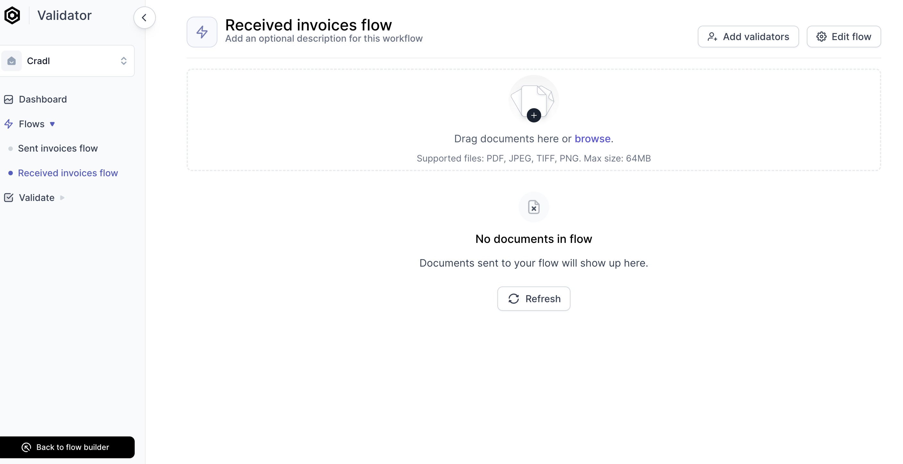
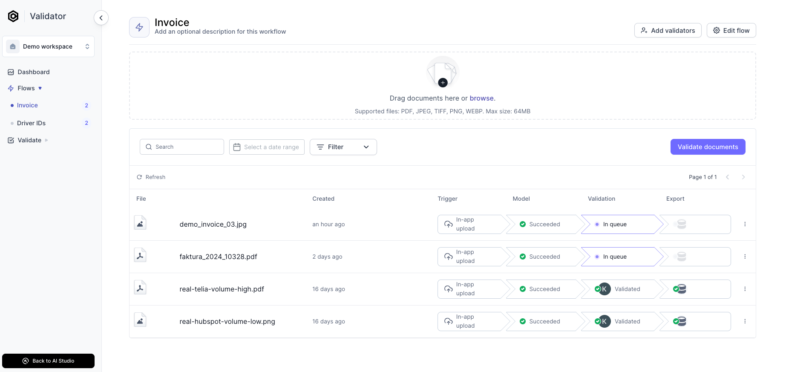
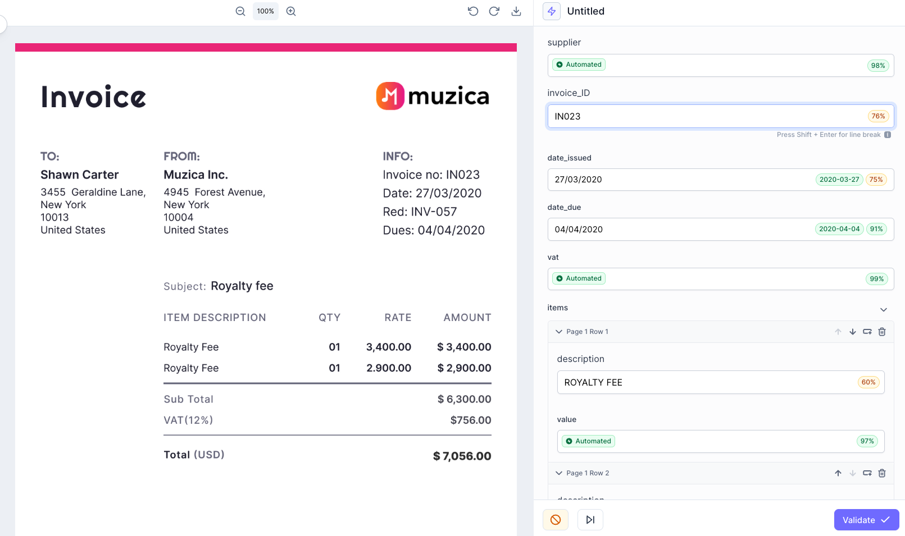

# How to validate documents

import ScrollProgressBar from '/src/components/ScrollProgressBar'

<ScrollProgressBar />
The goal of AI data extraction is to achieve a higher degree of automation and spend less time on manual data entry. Since no AI is flawless, you typically want to verify the extracted data somehow. The Cradl AI Validator lets you address this by improving its accuracy over time as it learns from corrections.
{/* :::info
This guide assumes that you have created, trained and tested your AI Model from the AI Studio steps.
:::

## 1. Upload documents 
Welcome to the `AI Validator`. Simply upload a document in order to start scanning.

Empty AI Validator view.

 */}

&#8226; **Click on Validate documents** to launch the validator.

## Validate documents 

**Correct the extracted data from documents**

Your AI Model has extracted data, and also assigned a confidence percentage to each extracted field.

If a field is correctly extracted you do not have to take any actions. If a field is incorrectly extracted, enter what the correct value should have been in its corresponding input field.

- If all the scores is above the confidence threshold (default is 95%), your model will not ask for human inspection.
- If one of the confidence scores is below your threshold, you will be notified and ask to validate the result (if you have added a user to the validator). 
- Your corrections will be used to improve the model when you retrain it. 

&#8226; **Click on Validate** once you have made any necessary corrections.

**Improving your model as you go**

 Whenever you make a correction, that correction will be used to make sure your AI Model does not repeat the same mistake.

:::warning
To retrain your model, you have to start a new training by **clicking on Improve model** from your model overview, and then on **Train model**. Your model will not retrain every time you validate a document, only when you run a new training.

A general rule of thumb is to retain your model every time you double your dataset. For example, if your first training consisted of 5-7 documents, you should retrain your model after you have validated 10-14 documents. This will ensure that your model improves as your dataset grows.
:::
