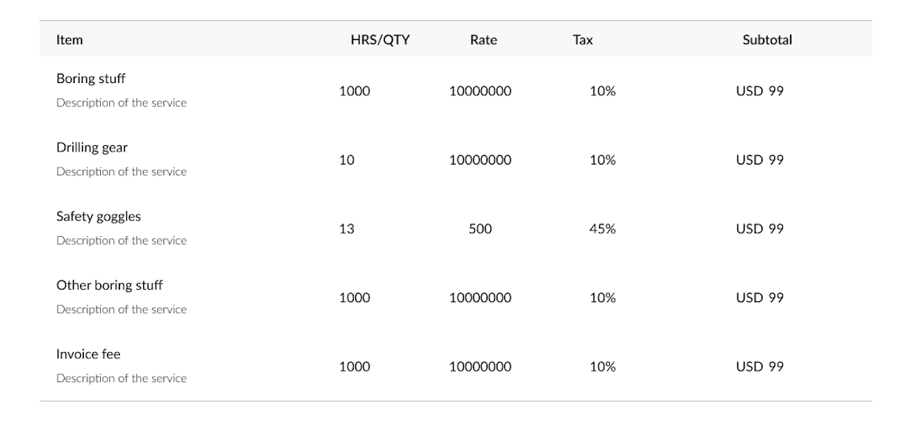
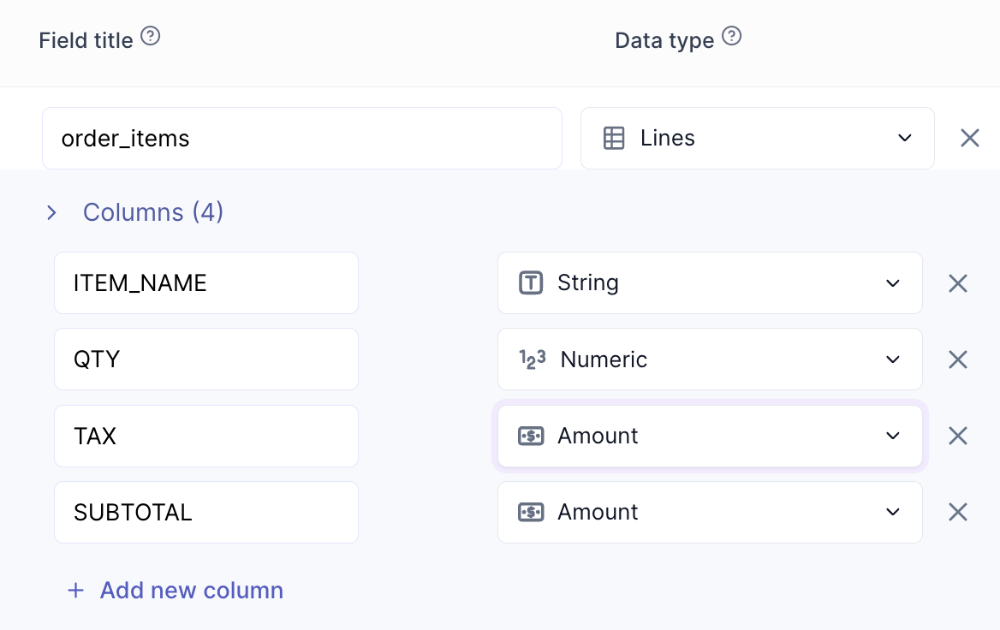
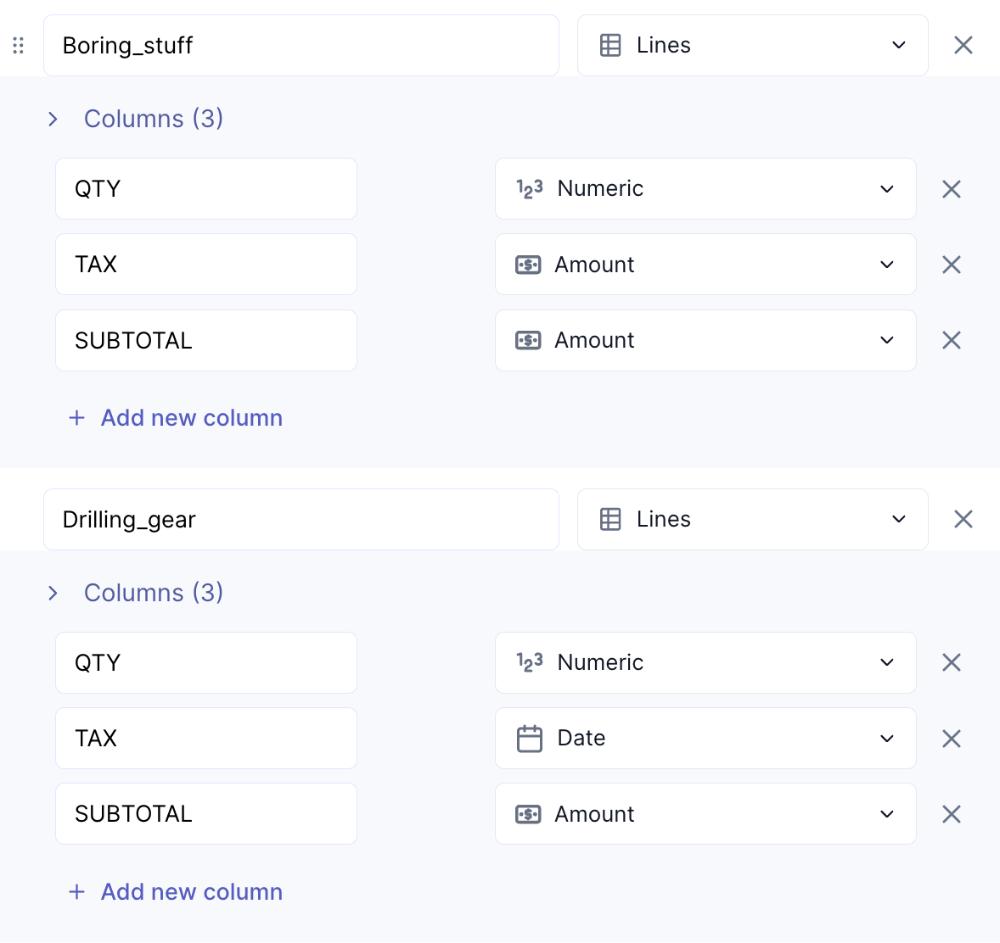

import Tabs from '@theme/Tabs';
import TabItem from '@theme/TabItem';

# Lines

## When to use a Lines field
  A Lines field is used for column layouts. You only need ***one*** Lines field for an entire table of columns. 
  
  The most common example of a Lines field is a list of products. It typically contains a product name, price, quantity, product code, etc. 
  

  

    
  

A common mistake when creating a Lines field is to create a Lines field that corresponds to a singular line on your document. One Lines field can contain a whole table of items &lpar;which will save you *a lot* of time&rpar;.

    <Tabs>
  <TabItem value="example-1" label="Correct" default>
   

        
A correctly created Lines field &lpar;of the above table&rpar;. 1 Lines field for 1 table. 

       
    

  </TabItem>

 <TabItem value="example-2" label="Incorrect" default>
     

                
An incorrectly created Lines field &lpar;of the above table&rpar;. 1 Lines fields for 1 specific line in a table. 

       
    

  </TabItem>

</Tabs>

## How to annotate a Lines field
You do not need to annotate every line in a Lines field. It is sufficient to annotate a ***minimum of 3 lines*** if your Lines field is several lines long. 

So, if a table on your document has 20 lines, you can annotate 3 of the lines instead of all 20. In such a case, it is recommended to annotate 3 ***random*** lines rather than the first 3 lines in the table, for best results.

## How to validate a Lines field
You should validate every incorrecty extracted line in a line item field. 

If you model has skipped one of your lines so that it is not present in your output, you should add a new column for that item and annotate it with the values it should have extracted. 