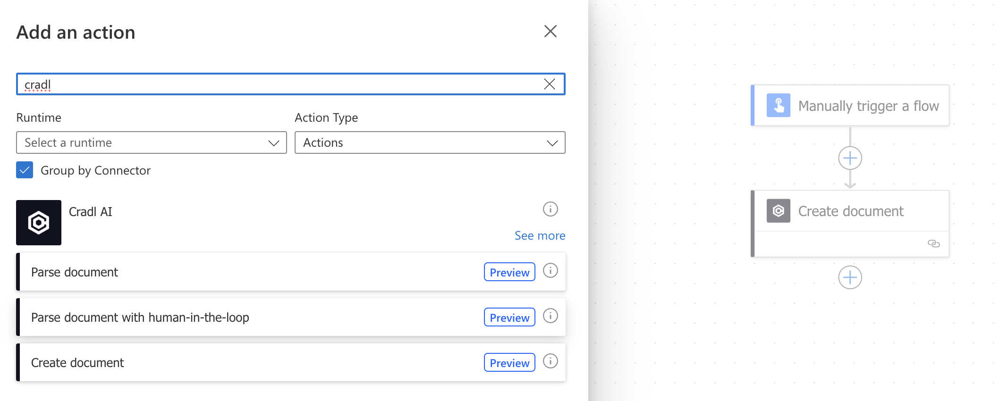

    
    

{/* # Integrating Power Automate with Cradl AI */}
Power Automate is a popular automation platform. Cradl AI has a connector that you can easily integrate into your automation flows in Power Automate. 

:::info
### Prerequisites
- You need a CRADL AI Model. [Follow these steps if you do not have an AI Model.](/aiStudio/new-model)
- You need a Microsoft 365 account. [Follow this link if you do not have one.](/aiStudio/new-model) 
:::

### Sign into Power Automate and create new Connector
Inside Power Automate: 
- Go to **My flows**
- Click **New flow**
- Click **Instant cloud flow**

You can give your flow a name and choose how to trigger the flow
- Choose a name. I.e: "My invoice flow". The name is only for your convenience. 
- Select **Manually trigger a flow**
- Click **Create** 

    

- **Click on the «Manually trigger a flow»** box to add an input.
- **Select file** from the user input options.

    

- **Click the + icon** below your «Manually trigger a flow» box.
- **Click Add an action** from the menu.
- Search for "cradl" and Select **Create document** from the available Connectors.

    

You will be prompted to Create Connection if this is your first time connecting Cradl AI to Power Automate.
- Give you connection a name.
- Log into your Cradl AI account in order to generate your credentials.

    

- Inside your Flow overview in your Cradl AI account, **click Add trigger** and **select PowerAutomate**  

    

- Back in Power Automate, paste your credentials into the Client Credentials field and click **Create new**. 
- You will prompted to create a new document. Give your document a name. 
- In the Body field, click the **lightning bolt icon**, click **See more**, and select **File content contentBytes** .

    

- Click the + icon below your Create document box to **Add an action**.
- Search for "cradl" again, and **select Parse document with human-in-the-loop** 

    

- From the Workflow dropdown, **Select your workflow** from the options.
- In the Document ID box, **click the lightning bolt icon** and **select body/documentId** from the options.

    

- From the top navigation bar, **Save** your flow and click **Test**.

- **Select Manually** and **click Test**.
- You will be shown your log in status. **Click Continue**
- **Upload a file** you would like to process and **click Run flow**.

    

- Head back to your Flow overview in Cradl AI.
- **Click Go to Validator**
    

- Inside the Validator, **click Validate documents**.
- (If the validation status of your document has not updated, **try clicking Refresh**)
- **Click Go to Validator**
    

Congratulations, you should be seeing your first parsed document with the Power Automate integration up and running.

    

