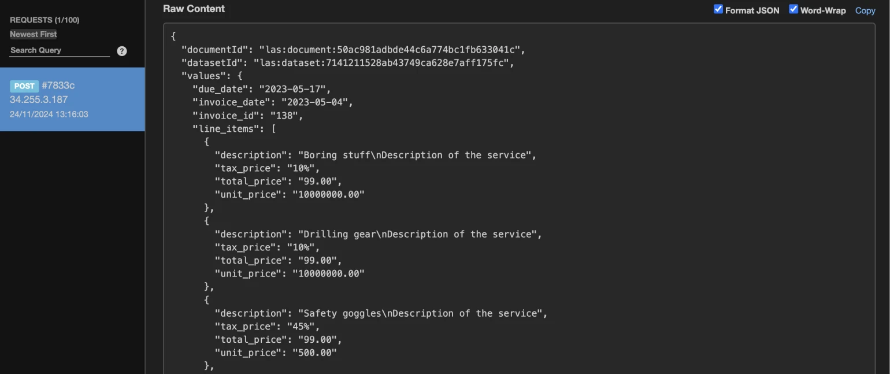

import HeaderWithIcon from "/src/components/HeaderWithIcon";

<HeaderWithIcon
  icon="/img/icons/icon-webhook.svg"
  copy="Webhook Integration"
></HeaderWithIcon>

Cradl AI supports webhooks, allowing you to automatically receive extracted
data in JSON format.

<div className="utils-spacerBottom-md"></div>

## Connecting to a webhook endpoint

:::info

You need a Cradl AI Model to follow these steps. [How to create an AI Model.](/aiStudio/new-model)
:::
It only takes a few clicks to connect to a webhook from Cradl AI.

Select `Webhook` from the list of Export options:

<div className="image-backdrop">
  <div className="image-backdrop-caption text-sm"></div>
  
</div>

Paste your webhook endpoint into the Endpoint URI, and save. You're now connected to your endpoint.

<div className="image-backdrop">
  <div className="image-backdrop-caption text-sm"></div>
  
</div>

To quickly test your connection, go to [Webhook.site](https://webhook.site) and paste your unique, auto-generated endpoint into your webhook URI field. Upload a document in Cradl AI, validate it, and then inspect the JSON payload directly on Webhook.site.

<div className="image-backdrop">
  <div className="image-backdrop-caption text-sm"></div>
  
</div>

<div className="utils-spacerBottom-md"></div>

## Request and JSON payload

Cradl AI sends a `POST request` to your specified webhook endpoint whenever a document is validated in Cradl AI. The request includes a JSON payload containing the extracted values and various metadata.

JSON payload of an invoice example:

```
{
    "documentId": "las:document:50ac981adbde44c6a774bc1fb633041c",
    "datasetId": "las:dataset:7141211528ab43749ca628e7aff175fc",
    "values": {
        "due_date": "2023-05-17",
        "invoice_date": "2023-05-04",
        "invoice_id": "138",
        "supplier_name": "Logoipsum Inc.",
        "total_amount": "534.68",
        "vat_amount": "39.68",
        "rotation": "0",
    },
    "validatedPredictions": {
        "due_date": {
          "automated": true,
          "confidence": 0.99,
          "isEdited": false,
          "pages": [
            0
          ],
          "rawValue": "May 17th, 2023",
          "value": "2023-05-17"
        },
        "invoice_date": {
          "automated": true,
          "confidence": 0.99,
          "isEdited": false,
          "pages": [
            0
          ],
          "rawValue": "May 4th, 2023",
          "value": "2023-05-04"
        },
        "invoice_id": {
          "automated": true,
          "confidence": 0.99,
          "isEdited": false,
          "pages": [
            0
          ],
          "rawValue": "138",
          "value": "138"
        },
        "supplier_name": {
            "automated": true,
            "confidence": 0.99,
            "isEdited": false,
            "pages": [
                0
            ],
            "rawValue": "Logoipsum Inc.",
            "value": "Logoipsum Inc."
        },
        "total_amount": {
          "automated": true,
          "confidence": 0.99,
          "isEdited": false,
          "pages": [
            0
          ],
          "rawValue": "534.68",
          "value": "534.68"
        },
        "vat_amount": {
          "automated": true,
          "confidence": 0.99,
          "isEdited": false,
          "pages": [
            0
          ],
          "rawValue": "39.68",
          "value": "39.68"
        },
    },
    ...,
}
```
