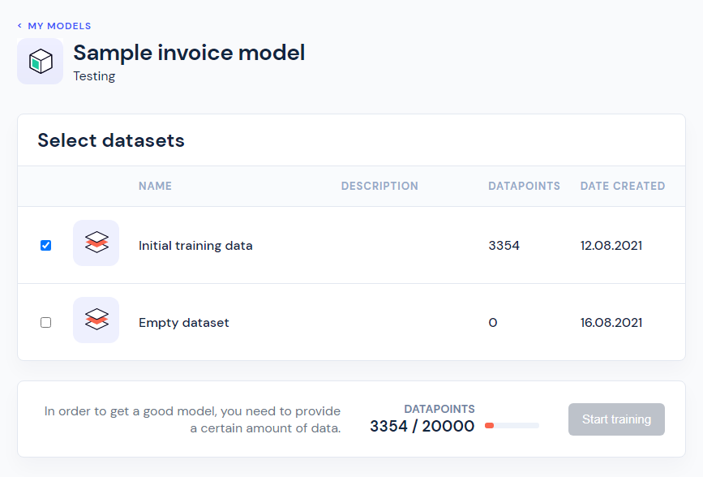

# Train model

Once you're satisfied with your training data, you can make a request to train your model. Training of models may only be requested through the Cradl UI for now - the API will have this feature publically available soon!

Under your selected model in the Cradl UI, just go to the **Training** tab and click the **New training** button:

You'll then be presented with your currently available datasets, where you may select the relevant ones for your model to perform training with:

After selecting enough datapoints and starting the training, you'll see the training job list has been updated with the current model being set as having the status `training`:

