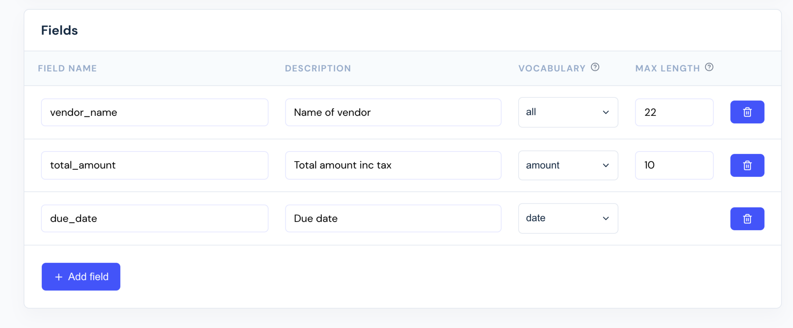
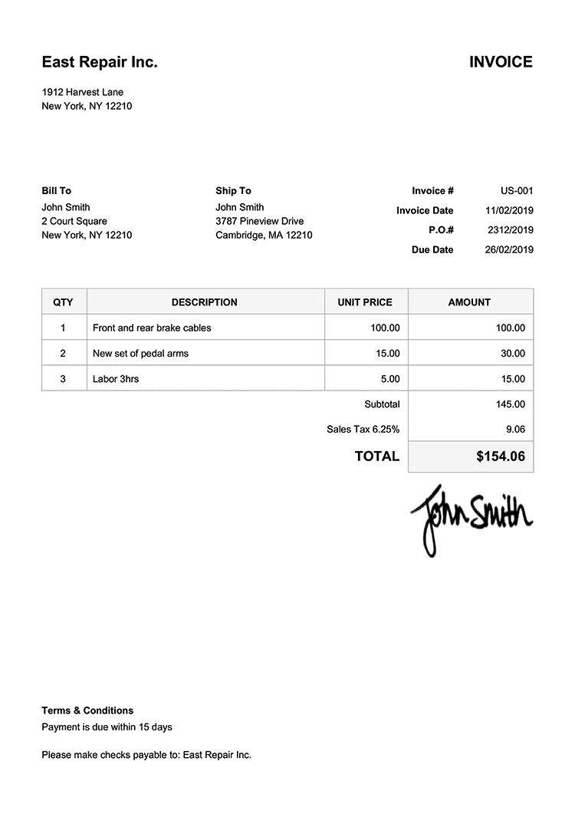

# Invoice OCR model
In this guide you will learn how to train a OCR model that is customized to *your* invoices, and extracts the information *you* need.

### Prerequisites
1. **Data**, a minimum of 5000 pairs of invoices and ground truths. See [the next section](#2.-gather-training-data) for a concrete example.
2. A free Cradl account. [Sign up here](https://cradl.ai). 
 
## 1. Configure your model
First, we need to configure the behavior of the model. 
 - In Cradl, go to **Models > New model**.
 - Give your model a name, and add an optional description.
 - Add fields
   - **Field name**: The name of the field you want to extract from your invoices, keep in mind that field names should match the names in your dataset.
   - **Description**: An optional description for the field. 
   - **Vocabulary**: The set of symbols that is allowed in a prediction of this field. Smaller vocabularies reduces training time. 
   - **Max length**: The maximum number of symbols that a prediction of this field can contain. Shorter sequences reduces training time.



## 2. Gather training data
- Prepare training data locally - create pairs of invoices and ground truths as examplified below.
     


```json
[  
   {    
      "label": "vendor_name",    
      "value": "East Repair Inc."
   },    
   {    
      "label": "total_amount",    
      "value": "154.06"
   },  
   {    
      "label": "due_date",    
      "value": "2019-02-26"
   }
]
```








- Go to **Datasets > New dataset**.
- Give your dataset a name, and add an optional description. 
- If your data contains personal data (any information relating to an identified or identifiable natural person directly or indirectly), you need to agree to our [Data Processing Agreement](../administration/legal.md). 
- Go to **Datasets > YourDataset > Upload data**.
- Select files and press **Start upload**.
  


## 3. Train your model
To make sure that your dataset is compatible with the model we have to create a [data bundle](../concepts/training-data.md) 

- Go to **Models > YourModel > Data bundles > Select Data** 
- Give your data bundle a name, and add an optional description.
- Choose the dataset you want to train on.
- Choose **Create Data Bundle** and wait for the data bundle summary to appear.
- Inspect the summary to make sure that the training data is of sufficiently good quality to start training.
- Go to **Models > YourModel > Training > New training** and choose the data bundle you created in the previous step.

Congratulations! Your model is training. Keep an eye on the status of your model, when it has changed to *active* you can test it and start using it as you wish.